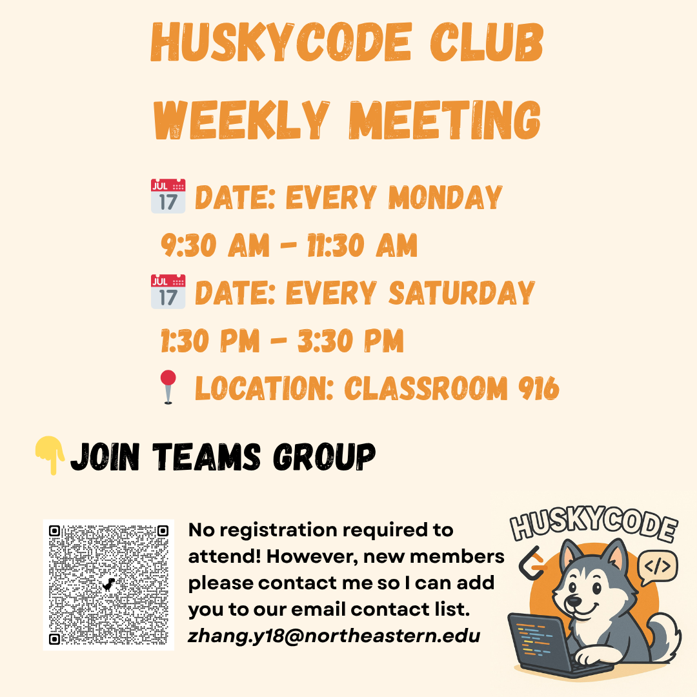

# HuskyCode Club 🐺💻

Welcome to the official repository of Northeastern University Silicon Valley HuskyCode Club!

Our Club aims to create a collaborative community for students passionate about LeetCode. Through structured practice groups divided by skill level and shared resources, we'll help improve your problem-solving abilities and build confidence.

## 📊 About Us
- 👥 90+ Active Members
- 🚀 Focus: Summer 2026 Internship Preparation
- 💪 All skill levels welcome (Beginner to 300+ LC solved)
- 📅 **Weekly LeetCode Sessions**:

  

### HuskyCode Club October LeetCode Plan
- Week 1 (9/29-10/5): Arrays
- Week 2 (10/6-10/12): Strings
- Week 3 (10/13-10/19): Hash Tables
- Week 4 (10/20-10/26): Review Week
- Week 5 (10/27-11/2): Linked Lists
### HuskyCode Club November LeetCode Plan
- Week 1 (11/3-11/9): Binary Search + Greedy
- Week 2 (11/10-11/16): Stacks & Queues
- Week 3 (11/17-11/23): Trees
- Week 4 (11/24-11/30): Graphs
## 🚀 Join Us!
👉 **[Click here to register for HuskyCode Club](https://forms.office.com/r/kNFiykMeFM)** 👈

After registering:
1. Join our ([Teams Group](https://teams.microsoft.com/l/channel/19%3AN_6dYIL9k2-ok2J82L8HBpfBrkgPsbxzeSwkFUEMrZw1%40thread.tacv2/General?groupId=55eda15f-32aa-493d-8805-15630014071e&tenantId=a8eec281-aaa3-4dae-ac9b-9a398b9215e7))
2. Check out our resources below

## 📚 Resources

### 📖 For Beginners:
- [NeetCode (Video Solutions & Roadmap)](https://neetcode.io/)
- [Algo Monsters](https://algo.monster)
- [Design Gurus](https://www.designgurus.io)

### 💻 LeetCode Lists
- [Grind 75](https://www.techinterviewhandbook.org/grind75)
- [NeetCode Blind 75 (With Video Solutions)](https://neetcode.io/practice?tab=blind75)
- [LeetCode Patterns](https://seanprashad.com/leetcode-patterns/)
- [Pattern Recognition](https://www.youtube.com/watch?v=xo7XrRVxH8Y/)

### 👩‍💻 Learning Resources:
- [System Design Primer (Available in Multiple Languages)](https://github.com/donnemartin/system-design-primer)

### 📊 Code Visualization Tools:
- [Online Python visualization tool](https://cscircles.cemc.uwaterloo.ca/visualize?utm_source=chatgpt.com#mode=display)

## 📝 Job Resources
- [The Ultimate 2026 U.S. Internships List](https://www.intern-list.com/)
- [2026 Software Engineering Internship & New Grad Positions](https://github.com/speedyapply/2026-SWE-College-Jobs)
- [Jobright AI (AI-Powered Job Matching)](https://jobright.ai/jobs/recommend)
- [Startup Job Platform - Wellfound](https://wellfound.com/jobs)

## 🤵Technical Interview Preparation
- [How to solve a Google coding interview question](https://www.youtube.com/watch?v=Ti5vfu9arXQ)
- [How I Failed the Google Coding Interview (and lessons I learned)](https://www.youtube.com/watch?v=4SUJt3dP2Jc)
- [Video Recommendation System Interview Prep](https://bytebytego.com/courses/machine-learning-system-design-interview/video-recommendation-system)
- [Hello Interview - Pay a current SWE at Big Tech to interview you and other interview resources](https://www.hellointerview.com)
